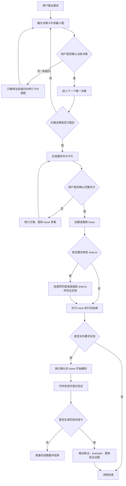

# Build It Up：需求落地助手

`build-it-up` 是一个面向 Codex 的中文 skill，用来把模糊的产品或工程需求，逐步整理成：

1. 通俗易懂的需求说明。
2. 可执行的实现方案和行动指南。
3. 与方案术语保持一致的 Mermaid 图。
4. 可评审、可验收的 issue。
5. 在条件满足时，与 draw.io 文档互相链接的图表交付物。

它还维护一条可回放的实现闭环：issue / 设计记录说明为什么做，example 展示最短公共 API 组装路径，断点指南说明如何观察，测试提供证据，commit 固化变更，最终实现记录把这些对象重新串起来。

Commit 记录也属于这条闭环的一部分：类型前缀保持稳定，标题主体和记录正文根据当前用户语言切换，避免中文需求最后留下难以理解的英文空泛提交，或英文任务混入中文标题。例如：

```text
中文任务：feat(example): 增加最短公开组装路径
英文任务：feat(example): add the shortest public assembly path
```

默认将代码与验证放在实现 commit（C1），将阶段完成卡和实现记录放在记录 commit（C2）。阶段完成卡会保存两个 commit 的完整 SHA、原始 message、语言和关联对象，方便后续从 Git 历史回放本次实现。详细规则见 [`references/commit-recording.md`](references/commit-recording.md)。

每张决策卡片默认都会带一张或几张由 AI 自动选择类型的图：用流程图表达先后，用时序图表达协作，用状态图表达变化，用范围图或对比图表达取舍。图中会显式标记推荐方向、本阶段范围和暂不包含的内容。

这里的“图”不是把文字换成几个方框，而是展示一个真实场景：用户输入什么、系统具体做了什么、数据或状态如何变化、用户最终看到什么，以及这个结果验证了什么。例如，不画“验证应用 → 尽快获得证据”，而画：

```text
输入 `add 买牛奶`
        ↓
解析为“新增任务”
        ↓
选择新增路径
        ↓
创建任务 #1「买牛奶」
        ↓
终端显示「已添加 #1：买牛奶」
```

如果需要解释范围，再补一张“这次验证了什么 / 暂时不验证什么”的覆盖图。这样用户看到的是将要发生的事情和可验证结果，而不是推荐理由的图形化复述。

它的核心原则是：先用一张或几张合适的图帮助人看懂当前唯一需要做的决定，再逐步建立共识、issue 和图表；得到用户明确确认后，才进行外部写入；如果用户另外要求，才进入写代码阶段。

它不是“无限提问的需求访谈”。默认只确认会改变目标、范围、验收标准或重大技术取舍的事项；普通实现细节由 AI 采用合理默认值并记录假设，然后继续推进。

第一轮还会主动报告图表能力：Mermaid 是否可以直接生成、是否检测到 draw.io 网页版或桌面版控制能力，以及当前可以直接交付什么。即使用户没有主动提到 draw.io，也会看到这项状态说明；它只是能力告知，不会变成新的讨论问题。

代码实施完成并通过验证后，还有一个可选流程：AI 会只询问一次是否生成“阶段完成卡”。用户选择生成时，阶段完成卡不仅包含真实 example、关键路径断点、图和验证证据，还会写入仓库记录，并关联 issue、example 和完成 commit；用户选择不需要时，流程直接结束，不会再次进入需求讨论。如果用户一开始明确要求闭环记录，则直接执行，不再询问。

## 适合解决什么问题

当你有一个想法，但还没有把范围、实现方式和验收标准想清楚时，可以使用这个 skill。例如：

- “我想给系统增加用户登录功能，但不知道应该怎么拆分。”
- “请把这个需求整理成一个团队可以直接执行的 issue。”
- “先不要写代码，帮我理解这个功能应该如何实现。”
- “把这个功能画成 Mermaid，并绑定到 draw.io。”
- “评审一下现有 issue，补齐边界情况、失败路径和测试方法。”

它不适合直接替代编码、代码审查或大型项目拆解；它的重点是让需求在进入实现前变得清晰、可讨论、可验证。

## 工作流程



## 关键行为

### 中文输出

默认使用中文描述需求、方案、issue 和图表说明。用户明确指定其他语言时，跟随用户要求；技术名词如 `issue`、`Mermaid`、`draw.io`、`API` 和 `issue key` 保留原名，方便检索和实际操作。

### 明确的确认关卡

skill 不会把完整 issue 当作第一轮聊天的入口。第一轮优先展示一张“图先于文字”的决策卡片，只回答：

- 当前进行到哪个阶段。
- 现在只需要决定什么。
- 用一张或几张 AI 自动选择类型的图，直观展示方案关系、流程或范围。
- 推荐哪个选择，以及为什么。
- 本轮暂时不决定什么。

用户每次只确认一个关键决策。关键决策稳定后，才展示最终共识卡片和完整 issue 草案。

当目标、范围、具体场景、可观察结果和主要边界已经明确时，讨论自动结束，进入方案、issue 草案或已经授权的下一步行动。不会为了文件名、目录、测试组织等低风险细节一直追问。

用户确认前，skill 可以：

- 只读检查仓库和现有文件。
- 分析需求和技术约束。
- 生成方案、Mermaid 图和 issue 草案。
- 根据反馈反复修改草案。

用户确认前，skill 不会：

- 写实现代码。
- 创建或修改远程 issue。
- 修改 draw.io 文件。
- 声称某个外部操作已经完成。

确认 issue 只代表 issue 和图表可以进入发布流程，不自动代表已经授权写代码。需要实现时，请再明确提出。

### Issue 内容

每个 issue 草案都会尽量包含：

- 背景与问题。
- 期望结果。
- 建议行为和边界情况。
- 工作范围与非目标。
- 可测试的验收标准。
- 代码区域、接口和数据变化提示。
- 测试策略。
- 风险、替代方案和待决策项。
- Mermaid 以及 draw.io 图表引用。

### Mermaid 与 draw.io

Mermaid 源码是确认前的可评审事实基准。issue 确认并发布后，skill 会使用 issue key 作为图表的统一身份，例如：

```text
ISSUE-123__user-login-flow
```

如果当前环境提供应用内浏览器或桌面应用控制能力，skill 可以尝试：

1. 创建或打开对应的 draw.io 文档。
2. 使用 issue key 和 issue 分类命名文件、页面或图表。
3. 导入或重建已确认的 Mermaid 图。
4. 将 issue 链接回填到图表，将图表 URL 或本地路径回填到 issue。
5. 视觉检查布局、标签和连接线。

本仓库没有虚构的 draw.io API 或固定连接器。如果当前环境无法控制 draw.io，skill 会提供 Mermaid 源码、建议文件名和手工导入及互链步骤，并明确说明哪些内容仍需手工完成。

### 实现闭环

每个实现阶段都会尽量留下以下可追溯关系：

```text
Issue / 设计记录
  → Example 最短组装路径
  → 关键断点与观察方法
  → 测试 / 手工验证证据
  → 完成 Commit
  → 实现记录回链全部对象
```

这让用户可以在其他 IDE + AI 中打开同一个 commit，运行 example，按断点逐步观察，并让 AI 基于实际变量和调用栈解释这次实现，而不是重新阅读一大段聊天记录。

为了避免记录文件无法引用“包含自身的 commit”，默认将提交分为两步：第一个实现 commit 固化代码、example 和测试；第二个记录 commit 固化阶段完成卡、实现记录和 issue/example 回链。记录中会同时列出两个 SHA；如果仓库采用单一最终 commit，也会明确说明闭环如何在该 SHA 中完成。

### 与其他访谈 skill 的关系

`build-it-up` 默认不调用 `grilling` 或 `grill-with-docs`。这些 skill 的目标是持续追问和压力测试方案，适合用户明确要求“不断追问”时使用；如果用户只是希望把需求讲清楚并尽快进入行动，使用本 skill 的有限讨论流程。

## 使用方式

显式调用：

```text
$build-it-up
```

也可以直接描述任务，例如：

```text
使用 $build-it-up，把“增加用户登录功能”整理成中文需求说明、Mermaid 图、issue 和编码前行动指南。先不要写代码。
```

如果希望绑定 draw.io，可以补充：

```text
方案确认后，请把 Mermaid 图绑定到我当前可用的 draw.io 网页版，并把 issue 和图表互相链接。
```

## 安装

从 GitHub 获取本仓库：

```bash
git clone git@github.com:Chengyunlai/build-it-up.git
```

然后将仓库中的 `build-it-up` 目录安装到 Codex 的 skills 目录。具体安装位置取决于你的 Codex 配置；也可以使用 Codex 的 skill 安装流程从 GitHub 仓库导入。

安装完成后，重启或刷新 Codex 的 skill 列表，然后使用 `$build-it-up` 调用。

## 仓库结构

```text
build-it-up/
├── SKILL.md                         # skill 的核心行为规范
├── agents/
│   └── openai.yaml                  # Codex UI 名称、简介和默认提示
└── references/
    ├── decision-card.md              # 逐轮共识交互协议
    ├── issue-template.md             # issue 结构与评审清单
    ├── drawio-binding.md             # Mermaid 与 draw.io 的绑定规则
    ├── implementation-loop.md        # issue、example、断点、验证与 commit 闭环
    ├── stage-completion-card.md      # 阶段完成后的可回放汇报模板
    └── commit-recording.md           # 按用户语言规范化 commit 的规则
```

## 本地校验

使用 skill-creator 提供的校验器：

```bash
python3 /path/to/quick_validate.py /path/to/build-it-up
```

校验器会检查 `SKILL.md` 的 YAML frontmatter、skill 名称、描述和未完成的占位符。修改 skill 行为后，应同时检查：

1. 是否仍然保持“确认前不产生外部变更”的关卡。
2. Mermaid 节点名称是否与 issue 术语一致。
3. draw.io 不可用时是否诚实提供降级方案。
4. 所有参考文档链接是否仍然有效。
5. 是否把未经确认的假设写成了确定事实。

## 设计边界

这个 skill 负责需求理解、方案表达、issue 起草和图表交接。它不绑定某一个 issue 管理平台，也不保证每个环境都能直接操作 draw.io；实际操作能力由当前 Codex 环境提供的 tracker、浏览器或桌面控制能力决定。
