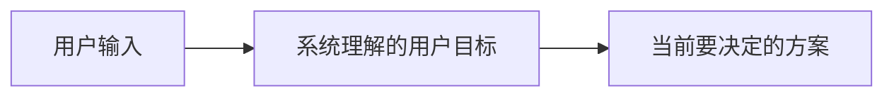
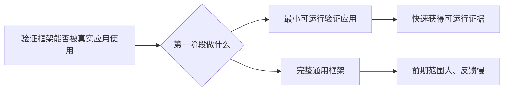

# 决策卡片协议

决策卡片是人与 AI 建立共识时的主要交互单位。它的目标不是展示 AI 已经想了多少，而是让人一眼知道：当前进行到哪里、现在只需决定什么、这个选择会带来什么结果。决策卡片默认是“图先于文字”的视觉交互，不是缩短后的文字报告。

## 每轮固定结构

除非用户主动要求完整方案，每轮按下面顺序输出，并控制在能快速扫读的长度：

```text
当前阶段：<探索问题 / 确定目标 / 选择载体 / 确定行为 / 形成方案>

一句话目标：<这次要解决什么>

现在只需要决定：<一个且只有一个决定>

一眼看懂：
<一张或几张由 AI 自动选择类型的最小图>

我的推荐：<推荐选项>

原因：
- <与当前仓库或需求直接相关的理由>
- <推荐方案带来的验证价值或代价>

本轮暂不决定：<明确列出 1–3 个容易让人分心、但还没轮到的事项>

请回答：<一个明确的问题>
```

“请回答”只能包含一个问题。需要多个决定时，拆成多轮；不要在一个问题后面追加“同时确认 A、B、C”。图必须出现在推荐理由之前或紧邻推荐理由的位置，让用户先看到关系，再阅读解释。

## 展示规则

1. **先给结论位置，再给解释**：第一屏必须出现“当前阶段”和“现在只需要决定”。不要先写长背景。
2. **图先于长文**：每张卡片至少有一张最小图；复杂问题最多给三张互补图。图的类型由 AI 根据问题选择，不把“请指定流程图还是架构图”变成用户负担。
3. **先说人话，再说术语**：先描述用户能观察到的行为，再给项目术语。例如“用户想做的事情（后续称为 Intent）”，不要直接把 `Intent` 当成已知概念。
4. **先给最小模型**：图表只展示当前决策所需的节点。通常使用 3–8 个主要元素；尚未确认的对象标为“待定”，不要为了完整而臆造。
5. **按问题选图**：顺序问题用流程图或时间线，协作问题用时序图或组件图，状态问题用状态图，范围问题用分层图或对比图，数据问题用 ER 图或数据流图。不要为了统一而所有问题都画流程图。
6. **图下只解释关系**：只补充箭头、边界、状态变化或方案差异中不可直接从图上读出的事实，不再重复整段背景。
7. **让图直接表达选择**：比较方案时在图中显式标出“推荐”与“备选”；范围问题区分“本阶段”与“后续 / 暂不包含”；流程或状态问题标出当前所在位置。用户只看图，也应能大致知道推荐方向。
8. **使用人能读懂的节点名**：图中优先使用“最小可运行验证应用”“完整通用框架”这类行为或结果描述，不要只放 `Application`、`Graph`、`Intent` 等内部名词。
9. **推荐必须带代价**：推荐一个选项时，同时说明它为什么适合当前目标，以及它暂时不解决什么。
10. **一次只推进一层**：用户询问一个词、一个节点或一个取舍时，只解释该点，然后回到当前决策。
11. **完整内容延后**：完整 issue、长 Mermaid、详细实现顺序、风险清单和测试矩阵，在关键决策稳定后再生成。
12. **不要把示例当产品**：如果使用 Todo、登录、订单等领域作为验证载体，明确标注“示例 / 验证载体”，并说明它为什么足够小、可以替换。

## 适合使用的最小图

当流程关系有助于理解时，只画当前问题需要的最小流程。实际执行时，图型由问题决定，不必固定使用流程图：



如果用户还不理解节点含义，先用文字解释，不要继续增加节点。

## 图的选择示例

如果当前问题是“先做一个小验证应用，还是直接实现完整框架”，应先画范围和路径，而不是直接画内部类图：



图下只需要补一句：当前建议选择“最小可运行验证应用”，因为它先验证公开 API 是否真的可用；完整框架仍是后续方向，不在这一轮决定。

## 从卡片进入完整 issue 的条件

只有同时满足以下条件，才进入完整 issue 草案：

- 用户已经逐个确认了影响范围的关键决策。
- 关键术语已经用自然语言解释，并且用户没有继续提出概念歧义。
- 正常路径、至少一个重要失败路径和非目标已经明确。
- Mermaid 图中的主要节点可以在 issue 中找到对应概念。

进入完整 issue 后，先给“最终共识卡片”，再给完整 issue。最终共识卡片只保留目标、已确认决策、范围、验收标准摘要和下一步动作，避免人再次从长文中寻找结论。
