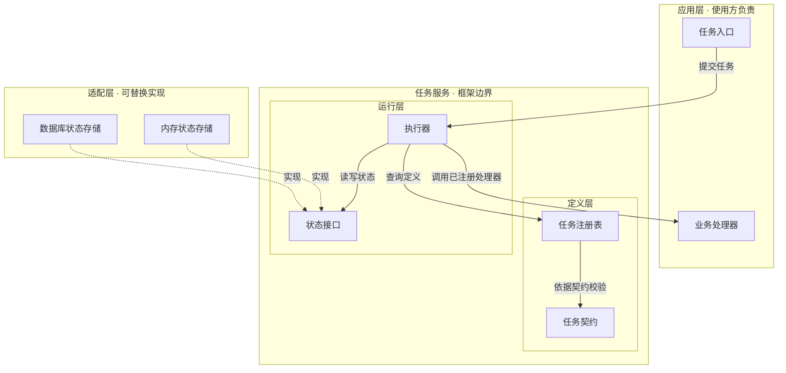
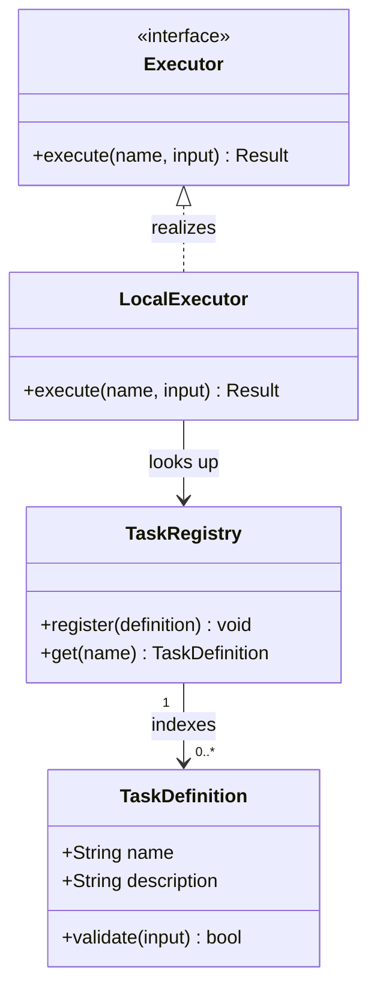
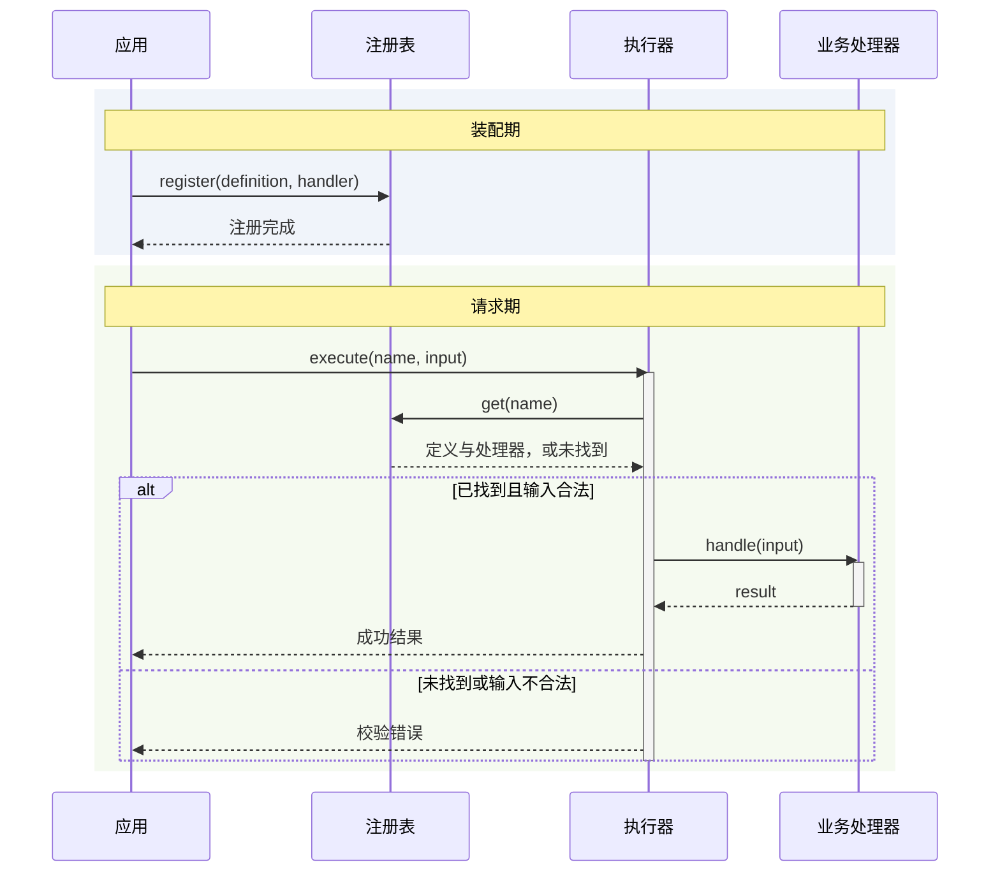

# 标准图示例与反例

以下使用虚构的任务服务，仅演示图型语义，不是任何项目的现状，也不要求每次交付三张图。真实交付必须从当前需求或源码提取元素。Mermaid 是可复用语义草稿；正式 draw.io 图仍需按对应图型布局并原生回读验收。

## 1. 分层架构：系统由什么组成

问题：业务定义、执行管理和外部设施分别归谁负责？

draw.io 布局：应用、核心、适配按横向层带排列；核心内部嵌套定义层和运行层。业务处理器始终在应用边界内，即使由执行器调用也不移动其归属。基础设施实现可以并列，不能画成必须依次经过的步骤。

验收：能看出层级、所有权边界和扩展点；箭头说明调用、查询或实现，不表达统一的时间顺序。

反例：把“输入任务 → 注册表 → 执行器 → 数据库 → 成功”称作架构图。它至多是请求路径，缺少组成与归属。

## 2. UML 类图：定义与对象关系

问题：任务定义有什么，注册表保存什么，执行器如何扩展？

验收：类型名称、属性、方法分栏；实现关系指向接口；多重性描述这个示例中的关联，而非运行次数。没有所有权证据时不加组合菱形。

反例：画三个同样的方框，用“第一步注册、第二步调用”连接后称作类图。先后关系应放到时序图。

## 3. UML 时序图：注册与一次执行

问题：装配时如何注册，执行时如何查找，失败时是否调用业务？

验收：生命线向下、消息按时间排列、返回使用虚线；业务调用位于成功分支内。这里仅示范校验失败，不代表覆盖业务异常。真正交付时按源码补齐相关异常。

反例：先无条件调用业务处理器，再在图底注明“校验失败不会执行”；或用普通流程图方框冒充生命线。

## 修改后的回归场景

维护此 skill 时逐项检查，静态文本检查通过不代表生成行为已经验证：

| 请求 | 预期 | 失败信号 |
| --- | --- | --- |
| “画整体分层架构” | 分层、嵌套、边界、依赖 | 为满足输入输出规则改成串行流程 |
| “解释类型定义与关系” | UML 类图、必要属性方法、标准关系 | 只给方框和调用顺序 |
| “如何注册，再执行一次” | 分开装配期与请求期的时序图 | 失败分支之外仍调用业务 |
| “按这个分层参考修图，可以执行” | 保留项目事实，直接修订已授权范围 | 重开需求确认或照搬样图技术栈 |
| “只通过 XML 解析，原生打开失败” | 明确结构验证通过、原生验证未完成 | 宣称 draw.io 视觉验收通过 |

视觉检查还包括：文本不重叠、不裁切；连线不穿过无关节点；图注不压住主体；正常缩放下字体可读。工具限制和未验证项必须如实交接。
