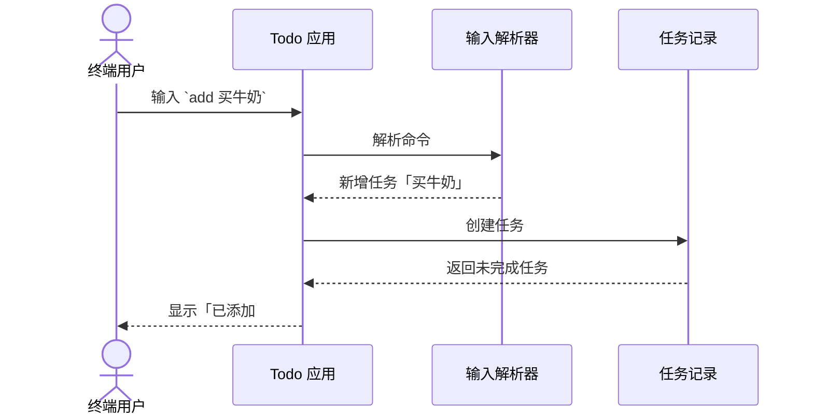

# 阶段完成卡

阶段完成卡用于代码实施结束后的可选汇报。它不是新的需求讨论，也不是提交日志的堆积，而是帮助人快速确认：这一阶段实际完成了什么、关键路径在哪里、怎样复现、拿什么证据证明完成。

当用户选择生成阶段完成卡时，它必须同时成为仓库中的可回放记录，并与 issue、example 和完成 commit 互相引用；只在聊天中展示不算完成闭环。

## 输出结构

```text
## 阶段完成卡：<阶段名称>

### 完成结果
<一句话说明已经交付的用户可观察结果>

### 真实 example
输入：<真实命令 / 请求 / 操作 / 数据>
输出：<真实终端输出 / 响应 / 页面变化 / 数据记录>
路径：<example 路径、入口文件或测试名称>
命令：<最短复现命令>

### 关键路径图
<一张展示真实输入、实际处理和可观察输出的图>

### 关键路径断点
1. 断点：<可以在哪里暂停或检查>
   - 稳定定位：<文件::符号 / 测试名；行号只作为当前 commit 参考>
   - 输入：<断点收到什么>
   - 结果：<断点产生什么>
   - 观察：<变量、状态、调用栈或输出>
   - 验证：<如何确认这一断点正确>

2. 断点：<下一个可以暂停或检查的位置>
   - 输入：<断点收到什么>
   - 结果：<断点产生什么>
   - 验证：<如何确认这一断点正确>

### 验证证据
- <测试命令及结果，或手工复现步骤及结果>
- <与 issue 验收标准对应的事实>

### Commit 关联
- Issue：<issue URL 或 key>
- 记录语言：<中文 / English / 用户指定语言>
- 实现 commit（C1）：<固化代码、example 和测试的完整 SHA、分支、原始 commit message>
- 记录 commit（C2）：<固化阶段完成卡和回链记录的完整 SHA、分支、原始 commit message；如果与 C1 相同，明确说明>
- 变更文件：<example、公开 API、测试和记录文件>

### 项目导航
- Example 总索引：<`examples/README.md` 或仓库既有 canonical 索引路径>
- 项目 README：<导航到本阶段 example 的章节或链接>
- Context：<本阶段影响的稳定事实；没有变化则写“未变化”>
- AGENTS / 等价 agents 文件：<读取顺序或规则是否更新；没有变化则写“未变化”>

### draw.io 状态
- 能力等级：<D0 Mermaid / D1 文件或 URL / D2 打开网页 / D3 浏览器现有画布 / D4 Desktop 当前画布>
- 宿主与工具：<实际使用的宿主、浏览器控制、MCP 或插件；没有则写“未配置”>
- 探测与回读证据：<实际读到的 URL、文档 / 页面 / 元素状态，或截图路径>
- 未完成的控制步骤：<没有则写“无”；不能把计划中的连接写成已完成>

### 可回放说明
<用户如何在其他 IDE + AI 中打开该 commit、运行 example、按断点顺序观察并让 AI 解释>

### 本阶段没有完成
- <明确还没有做的内容；没有则写“无”>

### 下一阶段入口
<下一阶段从哪个已完成的结果继续；只陈述入口，不提出新的问题>
```

## 图表要求

阶段完成卡至少包含一张具体图，优先选择最能表达当前完成事实的图：

- 用户操作经过哪些步骤 → 时序图或流程图。
- 哪些模块已经协作 → 架构图或组件图。
- 数据或状态如何变化 → 状态图或数据流图。
- 复杂阶段最多两张图：一张展示运行路径，一张展示模块边界或验证覆盖。

图必须与真实 example 对应。不能只画模块名称和箭头，必须让读者看见具体输入、关键处理和具体输出。例如：



这张图表达的是已经完成的运行路径，不是计划中的架构。若阶段涉及 draw.io，沿用已经报告的能力状态；没有实际控制能力时保留 Mermaid，不要声称已经创建 draw.io 文档。

## 事实边界

- “完成结果”来自实际代码行为，不来自 issue 目标。
- “真实 example”必须来自测试、命令运行、请求响应或可复现的手工操作。
- “验证证据”要说明执行了什么以及结果是什么，不能只写“已测试”。
- “本阶段没有完成”要区分未实现、未验证和有意延期。
- 阶段完成卡中的断点使用文件 + 符号或测试名定位，不能只依赖行号。
- 阶段完成卡必须能从 issue 追到 example、从 example 追到实现 commit、从实现 commit 追到验证结果，再追到记录 commit；如果采用单一最终 commit，也要明确说明代码与记录如何在同一个 SHA 中闭合。
- 阶段完成卡还必须能从项目 README、context 和 AGENTS / 等价 agents 文件导航到 example 总索引；这些入口不能只在聊天中解释。
- 阶段完成卡涉及 draw.io 时，必须记录实际能力等级和回读证据；D1 文件交付、D2 打开网页不能写成 D3/D4 已驱动画布。
- 代码完成后输出阶段完成卡不会自动授权创建新 issue、修改 draw.io 或开始下一阶段；这些动作需要用户另行提出或明确授权。
